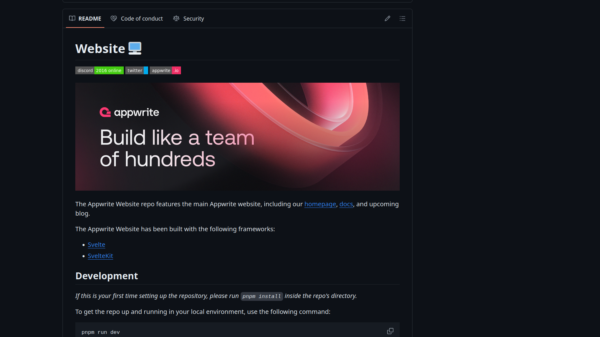
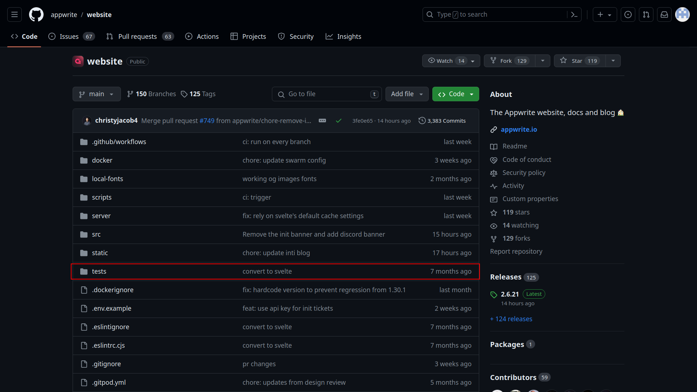
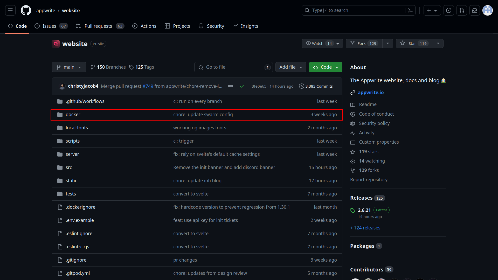
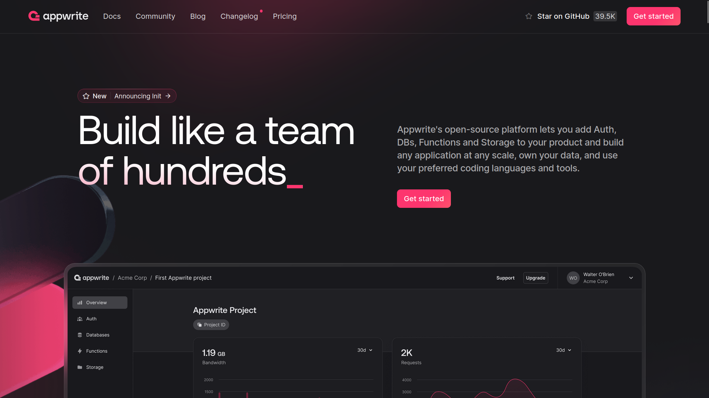

# How to Understand a Large Codebase Like a Pro

## Table of Content

- [Introduction](#introduction)

- [Read the Documentation](#read-the-documentation)

- [Read the Tests](#read-the-tests)

- [Pair with other Engineers](#pair-with-other-engineers)

- [Start with the Basics](#start-with-the-basics)

- [Be Curious, Don't Criticize](#be-curious-dont-criticize)

- [Study the Workflow](#study-the-workflow)

- [Use the Product/Service](#use-the-productservice)

- [Conclusion](#conclusion)

## Introduction

<figure>
  
  <figcaption style="text-align: center;">Designed by Freepik</figcaption>
</figure>

Developers spend a significant amount of time on open sourced projects or institutional codebases before they push commits to production. It is a nightmare for the developers who freshly landed on the codebase. At first glance, it may be hard to understand how all the files are working together without knowing some more context. In this blog, I will share with you some of my thoughts on how to explore a legacy codebase.

For the explanation part, Let's use Appwrite's codebase which is fairly big enough to threaten fresh developers.

## Read the Documentation

The first step I take when starting a new project is to read its documentation or README files. This allows me to get familiar with the project's setup and codebase. The documentation gives you a high-level understanding of the project's purpose, goals, and functionalities. This context helps you see how your contributions can fit into the overall picture.

<!-- Image of the README file of Appwrite -->

<figure>
  
  <figcaption style="text-align: center;">Appwrite's Website Documentation</figcaption>
</figure>

The documentation also provides information about the project's communication channels (e.g., forums, chatrooms) and contribution guidelines. This helps you learn how to interact with the project's community and get help when needed.

## Read the Tests

Check for unit, integration, or functional tests in your project. Run the tests and see what each test is doing. Tests often cover not just typical scenarios but also edge cases and error conditions. By reviewing them, you gain insight into potential problems and how the code is designed to handle them. Reading the config files and others can be boring, so you don't have to understand it all at once. You can always revisit it later. That is the key. This helps you write more robust code in the future.

<!-- Image of the test file of Appwrite -->

<figure>
  
  <figcaption style="text-align: center;">Read the Tests</figcaption>
</figure>

## Pair with other Engineers

Accessing the knowledge of an experienced developer who has already worked on the codebase can be helpful. By pairing up with this person, you can gain valuable insights into how certain things work and how to implement particular design patterns, testing, processes, and third-party code that are relevant to the project.

It is important to have a good relationship with other engineers on your team and make sure they are willing to answer your questions. In turn, you should also be willing to answer questions from others. Explaining what's going on is part of your job, so don't get annoyed by questions and always treat people with respect, as they are the ones who help make you valuable to the company.

<!-- Image representing teamwork -->

<figure>
  
  <figcaption style="text-align: center;">Designed by Freepik</figcaption>
</figure>

## Start with the Basics

It's always a good practice to start with the basics and understand the architecture before diving into the codebase. If you intend to work with Docker, it's essential to have a good understanding of container technology. Similarly, if you plan to work with service implementation, it's crucial to understand the fundamentals of service-oriented architecture. If you find it challenging to understand the code, take a step back and check if you're missing any basic information. If you're having difficulty understanding the code, it may be because you lack the necessary knowledge.

<!-- Image of architecture basics -->

<figure>
  
  <figcaption style="text-align: center;">Understand Basic Architecture</figcaption>
</figure>

## Be Curious, Don't Criticize

When you're dealing with legacy code, it's important to remember that it was written by experienced developers who made decisions based on the context at the time. Criticizing it can make people feel attacked and can hurt collaboration. Instead, approach it with empathy and ask questions to understand the thought process behind it. This can help you learn from past mistakes and get insights into the project's evolution. By doing this, you can cultivate a learning mindset and promote collaboration, which is critical to the success of any project.

<!-- Image of curious developer -->

<figure>
  
  <figcaption style="text-align: center;">Designed by Freepik</figcaption>
</figure>

## Study the Workflow

Take your time to understand the workflow of the most crucial parts of the codebase. It's essential to learn how different components connect. By tracing the flow of operations within a codebase, you can gain a better understanding of how everything works. This experience will help you act with precision when implementing features or fixing bugs within the codebase.

If you're unsure about how to get started, begin with a function. Read it carefully, then proceed to read and comprehend other functions or components that use it. You can repeat this process with modules, classes, and others until you have a solid understanding of the codebase.

<!-- Image of workflow -->

<figure>
  
  <figcaption style="text-align: center;">Designed by Freepik</figcaption>
</figure>

## Use the Product/Service

Before you start writing code, try to explore the platform like what it does. why it does? for whom it does? how fast it does?

Developers (You) write code for users to use the product and if you don't put yourself in the user's shoes you never know what the user might feel about a certain aspect of the platform. So, put yourself into the end user's shoes and understand what it is like to use the product. By having a good understanding of customers' needs, you can contribute features that end users will love.

<!-- Image of what Appwrite is like to use -->

<figure>
  
  <figcaption style="text-align: center;">Appwrite's Website</figcaption>
</figure>

## Conclusion

Having a strong understanding of a codebase can greatly increase your efficiency when working with a new codebase. By efficiently comprehending code written by other developers, you can improve your impact and productivity within an organization. This can be achieved by dedicating some extra time and patience towards learning the codebase.

Did you find the tips on how to navigate a new codebase useful? Here's how you can stay connected and continue learning. You can follow me [@JitendraC](https://twitter.com/JiitendraC) on Twitter, where I regularly tweet about software development tips, industry trends, and fascinating projects. If you know someone who could benefit from these insights, share this article with them on Twitter! Let's assist more developers in conquering complex codebases together.
