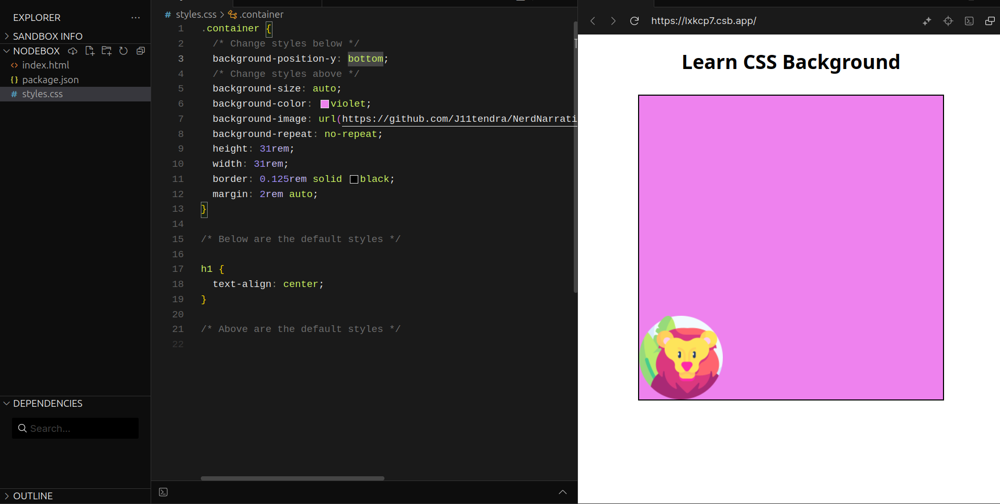

# Learn CSS Background

## Introduction

We can do some cool things with CSS background property such as creating a hero image or using it to do some cool parallax effects. In this article, we'll pretty much everything you need to know about CSS background property.

## CSS Background-color Property

Below you have a simple box with the class "container"; you can directly set the background color of the container by applying `background-color: <any color you want, let's say violet>` to the container itself. That's it it's that simple to change the background color, however, you can use many different colors like rgb, rgba, hex, and hsl.

<!-- Codesandbox e.g. background-color property -->

## CSS Background-image Property

Now you have to change the background image so you will set the background image of the container. You use `background-image: url(<paste the url of the image; assets/lion.png>)`. You can see the box has a background image but it is not what we expected. this is because the size of the image is much smaller than the size of the box or you can say the width and height of the box. So by default, it tends to fill up the space by repeating the same image vertically (on the y-axis) and horizontally (on the x-axis) until it covers the whole space.

<!-- Codesandbox e.g. background-image property -->

## CSS Background-repeat Property

Like you expected to have a single image in the box and not allow the image to repeat; this can be achieved by using `background-repeat: no-repeat` here you have a bunch of options such as `background-repeat: repeat-x` and `background-repeat: repeat-y` which is pretty much self-explanatory.

### background-repeat: no-repeat

<!-- Codesandbox e.g. background-repeat property -->

### background-repeat: repeat-x

<!-- Codesandbox img e.g. background-repeat-x property -->


### background-repeat: repeat-y

<!-- Codesandbox img e.g. background-repeat-y property -->


## CSS Background-size Property

Now you see you have a image taking a small portion of the box but you actually want to make this image take up the space. CSS has solution for this as well. You can use `background-size: <any pixel values, cover, contain>;` often `background-size: 150px;` is not preferred because you need to adjust the size of the image every viewport.

### background-size: auto;

Scales the background image in the corresponding direction such that its intrinsic proportions are maintained.

<!-- Codesandbox img e.g. background-size-auto property -->

- **background-size auto with repeat**
  <!-- background-size auto img -->

  

- **background-size auto with no-repeat**
  <!-- background-size auto img no repeat -->
  

### background-size: cover;

Scales the image (while preserving its ratio) to the smallest possible size to fill the container (that is: both its height and width completely cover the container), leaving no empty space. If the proportions of the background differ from the element, the image is cropped either vertically or horizontally.

<!-- background-size cover img -->


### background-size: contain;

Scales the image as large as possible within its container without cropping or stretching the image. If the container is larger than the image, this will result in image tiling, unless the background-repeat property is set to no-repeat.

<!-- background-size contain img -->


## CSS Background-position Property

The `background-position` property sets the initial position of the background image. The position is relative to the position layer set by `background-origin`. It is shorthand property for `background-position-x` and `background-position-y`; the first value is positioning on x-axis and second on y-axis.

```css
/* Keyword values */
background-position: top;
background-position: bottom;
background-position: left;
background-position: right;
background-position: center;

/* on x-axis and y-axis */
background-position: center top;
background-position: left center;
```

<!-- Codesandbox e.g. background-position property -->

### background-position-x;

It sets initial horizontal position (on the x-axis) of the background image.

```css
/* Keyword values */
background-position-x: left;
background-position-x: center;
background-position-x: right;
```

<!-- background-size contain img -->


### background-position-y;

It sets initial vertical position (on the y-axis) of the background image.

```css
/* Keyword values */
background-position-y: top;
background-position-y: center;
background-position-y: bottom;
```

<!-- background-size contain img -->



## CSS Background-attachment Property

The `background-attachment` property sets whether a background image's position is fixed within the viewport, or scrolls with its containing block. For this you need to add text on the box as to see the effect.

```css
/* Keyword values */
background-attachment: fixed;
background-attachment: local;
background-attachment: scroll;
```

### background-attachment: fixed;

The background is fixed relative to the viewport. Even if an element has a scrolling mechanism, the background doesn't move with the element. (This is not compatible with background-clip: text.)

<!-- Codesandbox e.g. background-attachment fixed 6 property -->

### background-attachment: scroll;

The background is fixed relative to the element itself and does not scroll with its contents. (It is effectively attached to the element's border.)

<!-- Codesandbox e.g. background-attachment scroll 7 property -->

### background-attachment: local;

The background is fixed relative to the element's contents. If the element has a scrolling mechanism, the background scrolls with the element's contents, and the background painting area and background positioning area are relative to the scrollable area of the element rather than to the border framing them.


## CSS Background-clip Property

The `background-clip` property is used to define how far the background image or color of an element should extend within the element. It determines whether the background should be drawn within the `border-box`, `padding-box`, or `content-box` of an element.

```css
/* keyword values */
background-clip: border-box;
background-clip: padding-box;
background-clip: content-box;
```

### background-clip: border-box;

The background extends to the outer edge of the border. This is the default value.

### background-clip: padding-box;

The background extends to the outer edge of the padding. The border area is not covered.

### background-clip: content-box;

The background is clipped to the edge of the content box. The padding and border areas are not covered.

## CSS Background shorthand Property
The `background` shorthand property is a convenient way to set multiple background-related properties at once. This can include background color, image, position, size, repeat, origin, clip, and attachment. Using the shorthand property can help to make it more readable.

```css
background: [background-color]
  [background-image]
  [background-position] / [background-size]
  [background-repeat]
  [background-origin]
  [background-clip]
  [background-attachment]
  [initial | inherit];
```

**When using the background shorthand, the values should be specified in the order outlined above. However, not all values need to be included. If a value is omitted, the default for that property will be applied.**

## Conclusion
Whether you're setting a simple background color or creating complex layered backgrounds with images, CSS provides the flexibility to achieve your desired design.

Mastering CSS `background` properties is essential for any web developer aiming to create engaging and visually captivating websites.

Thanks for reading this!! If you find this helpful; drop your reactions and share this piece with others.

You can also stay connected with me by following me here and on [X](https://x.com/jiitendraC), [LinkedIn](https://www.linkedin.com/in/jiitendrachoudhary/).
