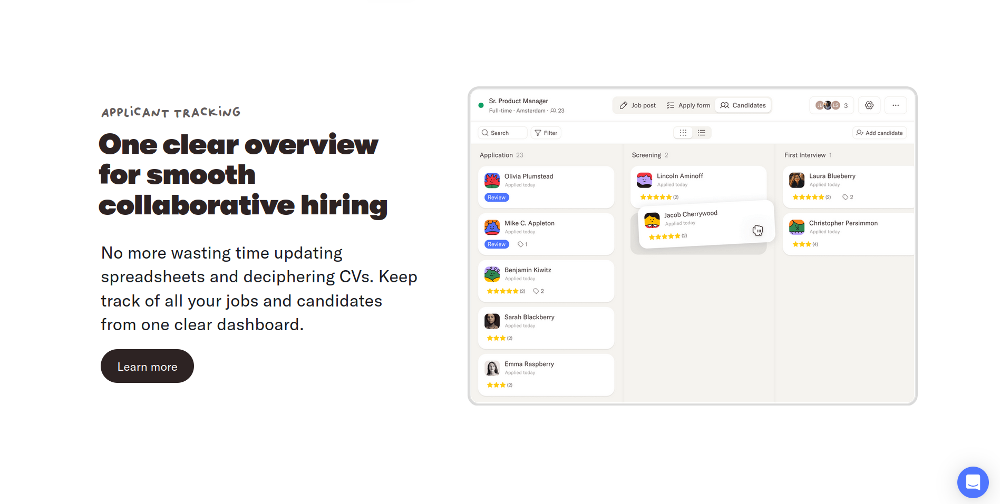
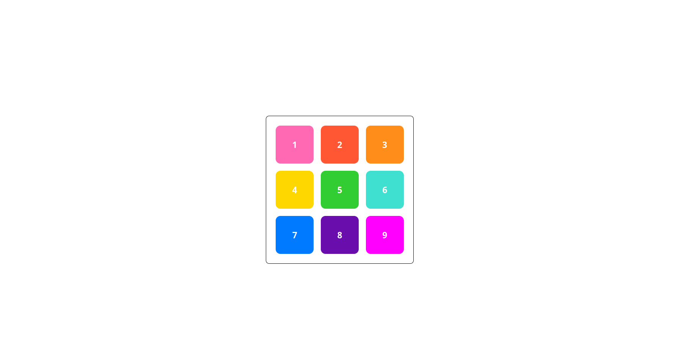
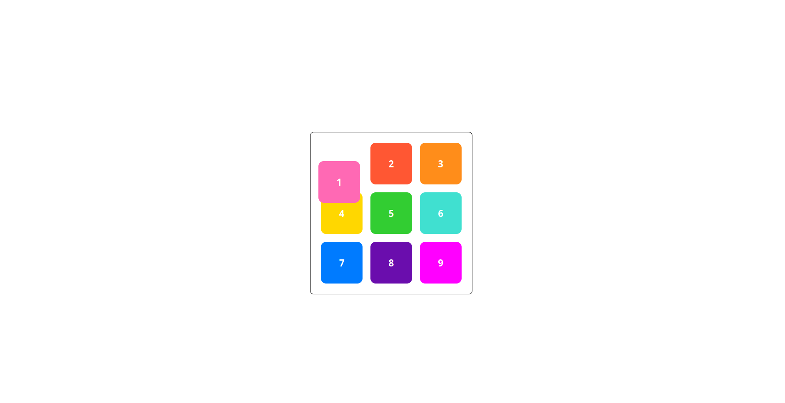
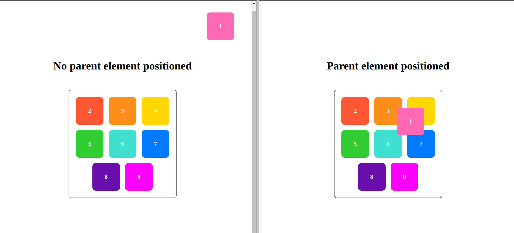

# Learn CSS Positions: with Real Examples

Let's start with even do you need css postions aren't the other properties enough to make you faint? Why css positions?

Say you want to create an navigation bar which stays on the page when you scroll, or the chat with us icon/button that stays on the bottom right corner always. This things are placed outside of the document's (i.e the webpage) workflow.

For examples, You see below the chat button or the navigation bar is still visible even after scrolling.



To build elements having similar behaviour we use `CSS position`.

The `CSS position` property is used to define the position of an element on a webpage.

The position property has the following five values:

- static (default value)
- relative
- absolute
- fixed
- sticky

We will look into each of them.

Before we begin lets first understand the basic context; we have a very basic `div` which contains 9 more boxes each with different color and also has a number on it.

## CSS Static Position (default value)

The `position: static` property allows elements to be positioned in the normal flow of the document.

```

Note: This is the default value.

```

The below boxes has `position: static;`.

<!-- Eg of static -->



## CSS Relative Position

The `position: relative;` property positions the element relative to its original position. The `top, right, bottom, left` properties is used to move the element accordingly.

Here, we give `position: relative;` to box one and make it `top: 35px` and `right: 5px;`. So, the box one moves to the top and right to its original position.

```

Note: The space is still preserved in the original position of the element.

```

<!-- Eg of relative -->



## CSS Absolute Position

The `position: absolute;` property removes the element completely from the normal flow of the document.

It is positioned _relative_ to the nearest parent element having a position other than `static`.

If there is no parent with position other than `static`, then it is positioned relative to the document itself.

Below both the boxes has `top: 50px; and right: 50px;` only the difference is first eg is relative to the document(webpage) and second eg is relative to the border container.

Here, the box one is no longer the part of border container.

<!-- Eg of absolute -->



```

Note: An absolutely positioned element loses original space in the document flow.

```

## CSS Fixed Position

The `position: fixed;` property positions an element to remain fixed in the same position, even when the page is scrolled. It is similar to the absolute value, but it remains relative to the viewport at all times.

Here, the box one is positioned `50px from top and right` it will remain at the same position even when the page is scrolled.

<!-- Eg of fixed -->


## CSS Sticky Position

The `position: fixed;` positions the element in the combination of `fixed` and `relative` values.

This property allows the element to stick to specific position in the viewport as you scroll, but only within its containing element.

When you first scroll, the element behaves like it has relative positioning. It moves with the flow of the document.

Once the element reaches the specified position (defined by top, right, bottom, or left), it "sticks" to that position. It will stay in that position as you continue to scroll.

The element will stop sticking and resume normal document flow once the containing element (the nearest scrollable ancestor) is out of view.

<!-- Eg of sticky -->


## Conclusion

Thank you for reading!! If you find this helpful; drop your reactions and share this piece with others. Let me know into the comments, "Does CSS sucks?"

You can also stay connected with me by following me here and on [X](), [GitHub](), and [LinkedIn]().
